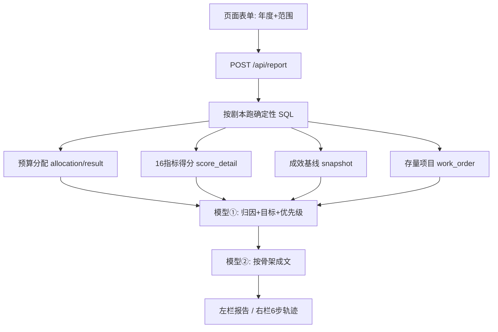

# 报告技能设计 —— 年度缺陷治理计划

> 目标：在页面上加一个表单，**接到请求即自动跑完**"预算分配 → 16 指标分析 → 治理目标 → 项目计划 → 预计成效 → 上报"这条固定流程，产出可上报的计划报告。
> 约定：取数复用现有 `run_sql` / `kb_search`，**不新增取数工具**；后期可并入 `/api/ask`。
> 状态：设计稿，待 Fred 审阅。

---

## 一、现状（只读实测，2026-09-16）

| 事实 | 出处 |
|---|---|
| 16 项评分标准（正/负向、满分基准、pass 线、规则原文）| `t_power_company_scoring_standard` `is_new=1`，正好 16 行 |
| 得分明细（raw → normalized → weighted、rank_no）| `t_power_station_score_detail` `deleted_flag=0`：**47 个供电所、737 行** |
| 权重 | `t_power_company_rank_weight`（23 行） |
| 预算总额 + 单位金额 | `t_power_company_budget_allocation` `is_new=1`（4 条，合计 **1880 万**）↔ `t_power_company_budget_result` `deleted_flag=0`（47 行，正好 1880 万）|
| 6 项成效基线 | `t_power_ai_metric_snapshot`：metric_code 恰好 6 个（salesVolume / lossRate / feedbackWorkOrder / faultRepairWorkOrder / averageOutageDuration / tripCount）|
| 治理项目 | `t_power_work_order` `deleted_flag=0`（工单、专业、状态、预算、计划/实际时间）|

**结论：这条链上的数已经算好了。**步骤 2 不需要重算评分，只需要读现成得分并解释——重算就是编数的源头。

## 二、流程与分工

| 图上一步 | 实现 | 模型调用 |
|---|---|---|
| 1 预算分配通知 | 读 allocation(is_new=1) + result(deleted_flag=0) → 各单位金额/占比 | 无 |
| 2 围绕 16 指标分析 | 读 score_detail(deleted_flag=0) + scoring_standard(is_new=1) → 得分、排名、加权分、点名拖后腿项 | 无（SQL 排序算） |
| 3 提治理目标 | 从"问题导向"4 项 + 预算执行里取该单位排名靠后的 → 映射到 6 项成效 → 生成方向与理由 | **模型①** |
| 4 项目计划 + 优先级 | 读 work_order 存量与进度 → 按目标排优先级 | **模型①（同批）** |
| 5 预计成效 | 读 snapshot 现状基线（+ comparison 同比） | 无 |
| 6 完整计划上报 | 按报告骨架把 1–5 成文 | **模型②** |

**模型只调用 2 次**（不是 6 次）：一次出"目标 + 优先级建议"，一次成文。取数全部确定性。

## 三、报告骨架（6 段，对应图上 6 框）

1. 预算分配情况 —— 全市合计、各单位金额与占比
2. 16 项指标得分分析 —— 得分/排名、加权分构成、哪几项拖后腿
3. 今年缺陷治理目标 —— 方向 + 依据（点名指标与排名）
4. 缺陷治理项目计划 —— 优先级排序 + 存量项目进度
5. 预计成效 —— 现状基线 → 目标
6. 计划上报 —— 今年准备干什么，汇总

## 四、接口与页面

- **接口**：`POST /api/report`，入参 `{year, scope}`，出参 `{report:{sections[]}, trace[], warnings[]}`
- **页面**：同一页顶部加「年度计划报告」表单（年度 + 范围），提交后**左栏出报告、右栏复用现有 trace 容器出 6 步轨迹**
- **表单入参**（如无异议按此执行）：年度默认取库中最新（2026）；范围 = 全市 / 某县公司；报告标题 = 「{年度+1} 年度缺陷治理计划」

## 五、文件改动清单

| 动作 | 文件 |
|---|---|
| 新增 | `secretary/reports/annual-defect-plan.json` —— 步骤 + SQL + 报告骨架（业务知识进数据，不进代码）|
| 新增 | `secretary/report.py` —— 编排：按 JSON 跑 SQL → 2 次模型 → 组装 sections + trace |
| 改 | `secretary/server.py` —— 加 `POST /api/report` 分支 |
| 改 | `secretary/static/index.html` —— 加表单 + 结果渲染（复用右栏 trace 容器）|
| 改 | `README.md` —— 文档地图加一行 |
| **不动** | `agent.py` 问答链路、`tools_db.py`/`semantic.py` 白名单、任何库表 |

## 六、实测发现的坑（实现时必须处理）

1. `score_detail` 有 **7475 行 `deleted_flag=1` 的旧版本** → 不滤就是旧得分。
2. 47 所 × 16 项 = 752，实际只有 **737 行** → 有 15 个格子缺，按所检查完整性，**缺就标"数据缺失"，不许补 0**。
3. `snapshot` 同一 period_key 有两组值，差别在 `source_summary_type`（`currentMonth` / `upCurrentMonth`）→ 不钉住这个字段，同一个"9 月停电时长"能读出差 8 倍的两个数。
4. 成效 station 口径 **49 个** scope_key，得分/预算口径 **47 个** → 两套口径要显式映射，对不上标缺失。
5. `t_power_push_line_loss` 是**空表**（0 行）→ 线损只能走 snapshot。
6. `budget_allocation` 有 19 个历史版本 → 必须 `is_new=1`。**顺带解决了 README §七.2 的"两个数"**：`is_new=1` 合计 1880 万与 `result(deleted_flag=0)` 47 行明细自洽。

## 七、验收标准（先定死，事后不改）

1. 报告 6 段齐全，与图上 6 框一一对应；
2. 报告里**每个数字都能在右栏追到「表 + SQL + 行数」**，追不到的必须不出现；
3. 引用评分规则时与 `scoring_standard.remark` 原文一致，不得自编公式；
4. **对账差为 0**：全市预算合计 = 1880 万；各单位金额合计 = `result` 汇总；
5. `/api/ask` 回归 30 题结果不变（问答链路未被污染）；
6. 全程 ≤ 60 秒。

## 八、技术栈与完成条件

- **技术栈**：Python 3.12 + 现有 httpx/模型客户端 + 现有手写 HTTP server + 原生 JS。**不新增依赖、不引前端框架。**
- **完成条件**：页面上选年度、点提交 → 左栏出 6 段报告、右栏出 6 步轨迹，且第七节 6 条全部通过。
---

## 九、实施后的修正（2026-09-16 实测推翻设计的地方）

1. **治理目标的选取方向反了。** 本稿第三节原写「取候选里排名靠后的项」，实测证明反了：**得分高 = 越该投入**（问题导向类「线损越高、得分越高」）。改为「候选 5 项锁定，选哪几项由模型结合本范围/全市对比与成效现状判断」。
2. **「预算执行」这一项不能用。** 47 个供电所里 40 个（85.1%）raw_value = 0，却被排名归一化成满分 100。已加「原始值为 0 占比 > 50% 的候选指标禁止当治理目标」的硬规则。
3. **全市范围下候选指标无区分度。** 排名归一化的 4 项在 47 所上的均分恒约 75.5，全市版改用成效现状的短板来定目标。
4. **「16 项完整性」判据不追求全绿。** 新城供电所只有 1 条得分，是真实数据缺口，代码如实报 FAIL，不抹平。
5. **第五节改为给建议目标值。** 以现状均值为起点、该指标最优供电所为参照，标注「建议值，需审定」。
6. **动了 agent.py 一行**：_chat 增加可选 max_tokens（默认值不变）。原设计说不动 agent.py，但成文需要 3000 token，硬编码 1500 会截断。
7. **验收标准 5（30 题全量回归）**：regression.py 与 e2e_raw.py 调用的是 agent.ask 已被移除的 complete 参数 —— 一跑就全题异常，且 regression.py 会把基线覆盖成 33 行垃圾。已修（去掉该参数）并把旧基线另存为 output/regression_v3_旧基线_20260916.json 后重跑。

实测结果见 output/report_skill/效果报告.md。
